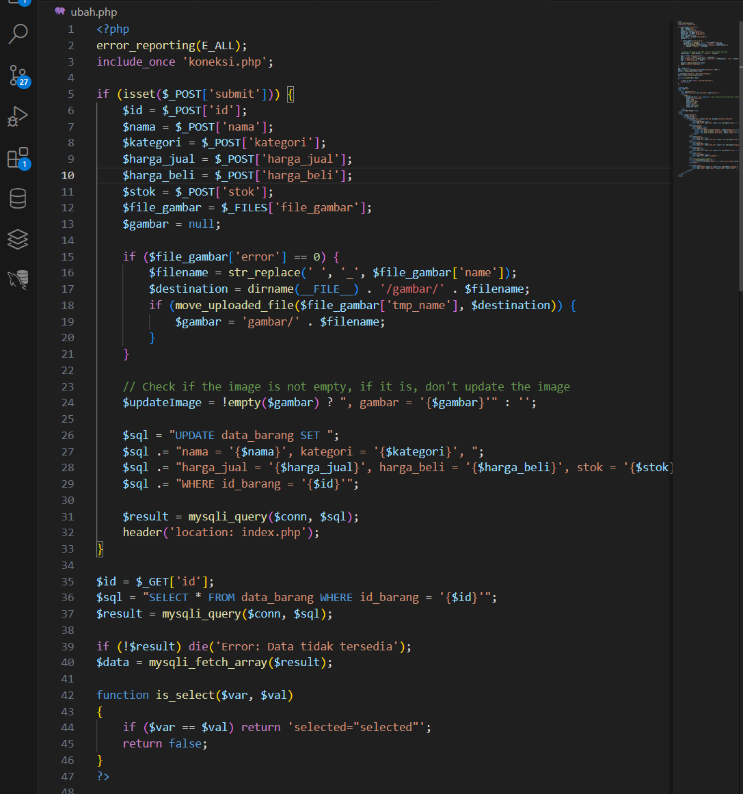

# Praktikum 8: PHP dan Database MySQL
```
Febriyani Nurhida
312210222
TI.22.A2
```
## Instruksi Praktikum
1. Persiapkan text editor misalnya VSCode.
2. Buat folder baru dengan nama lab8_php_database pada docroot webserver
(htdocs)
3. Ikuti langkah-langkah praktikum yang akan dijelaskan berikutnya.

## Langkah-langkah Praktikum
### Persiapan
Untuk memulai membuat aplikasi CRUD sederhana, yang perlu disiapkan adalah
database server menggunakan MySQL. Pastikan MySQL Server sudah dapat dijalankan
melalui XAMPP.

### Menjalankan MySQL Server
Untuk menjalankan MySQL Server dari menu XAMPP Contol.


### Mengakses MySQL Client menggunakan PHP MyAdmin
Pastikan webserver Apache dan MySQL server sudah dijalankan. Kemudian buka
melalui browser: http://localhost/phpmyadmin/


### Membuat Database
```
CREATE DATABASE latihan1;
```


### Membuat Tabel
```
CREATE TABLE data_barang (
id_barang int(10) auto_increment Primary Key,
kategori varchar(30),
nama varchar(30),
gambar varchar(100),
harga_beli decimal(10,0),
harga_jual decimal(10,0),
stok int(4)
);
```


### Menambahkan Data
```
INSERT INTO data_barang (kategori, nama, gambar, harga_beli, harga_jual, stok)
VALUES ('Elektronik', 'HP Samsung Android', 'hp_samsung.jpg', 2000000, 2400000, 5),
('Elektronik', 'HP Xiaomi Android', 'hp_xiaomi.jpg', 1000000, 1400000, 5),
('Elektronik', 'HP OPPO Android', 'hp_oppo.jpg', 1800000, 2300000, 5);
```


### Membuat Program CRUD
Buat folder lab8_php_database pada root directory web server (d:\xampp\htdocs)


Kemudian untuk mengakses direktory tersebut pada web server dengan mengakses URL:
http://localhost/lab8_php_database/


### Membuat file koneksi database
Buat file baru dengan nama koneksi.php. di sini saya pakai style css
```
<?php
include("koneksi.php");

$sql = 'SELECT * FROM data_barang';
$result = mysqli_query($conn, $sql);

?>
<DOCTYPE html>
<html lang="en">
<head>
    <meta charset="UTF-8">
    <link href="style.css" rel="stylesheet" type="text/css" />
    <style>
        th {
    background-color: pink;
    color: white;
    padding: 10px;
    text-align: left;
    font-size: 16px; /* Adjust the font size */
    font-weight: normal;
}
.tambah-button {
    background-color: pink;
    border: none;
    color: white;
    padding: 10px 10px;
    text-align: center;
    text-decoration: none;
    display: inline-block;
    font-size: 16px; /* Adjust the font size */
    margin: 8px 6px;
    cursor: pointer;
    font-weight: normal;
}
</style>
    <title>Data Barang</title>
</head>
<body>
    <div class="container">
        <h1>Data Barang</h1>
        <tr>
        <a href="tambah.php" class="tambah-button">Tambah Barang</a>
        </tr>

        <div class="main">
            <table border="1" cellpadding="5" cellspacing="0">
            <tr>
                <th>Gambar</th>
                <th>Nama Barang</th>
                <th>Katagori</th>
                <th>Harga Jual</th>
                <th>Harga Beli</th>
                <th>Stok</th>
                <th>Aksi</th>
            </tr>
            <?php if($result): ?>
            <?php while($row = mysqli_fetch_array($result)): ?>
            <tr>
                <td><?= $row['nama'];?></td>
                <td><?= $row['nama'];?></td>
                <td><?= $row['kategori'];?></td>
                <td><?= $row['harga_beli'];?></td>
                <td><?= $row['harga_jual'];?></td>
                <td><?= $row['stok'];?></td>
                <td>
                    <a href="ubah.php?id=<?= $row['id_barang'];?>">Ubah</a>
                    <a href="hapus.php?id=<?= $row['id_barang'];?>">Hapus</a>
                </td>
            </tr>
            <?php endwhile; else: ?>
            <tr>
                <td colspan="7">Belum ada data</td>
            </tr>
            <?php endif; ?>
            </table>
        </div>
    </div>
</body>
</html>
```


### Menambah Data (Create)
Buat file baru dengan nama tambah.php. Di sini saya pakai style css
```
<?php
error_reporting(E_ALL);
include_once 'koneksi.php';
if (isset($_POST['submit'])) {
    $nama = $_POST['nama'];
    $kategori = $_POST['kategori'];
    $harga_jual = $_POST['harga_jual'];
    $harga_beli = $_POST['harga_beli'];
    $stok = $_POST['stok'];
    $file_gambar = $_FILES['file_gambar'];
    $gambar = null;

    if ($file_gambar['error'] == 0) {
        $filename = str_replace(' ', '_', $file_gambar['name']);
        $destination = dirname(__FILE__) . '/gambar/' . $filename;
        if (move_uploaded_file($file_gambar['tmp_name'], $destination)) {
            $gambar = 'gambar/' . $filename;;
        }
    }

    $sql = 'INSERT INTO data_barang (nama, kategori, harga_jual, harga_beli, stok, gambar) ';
    $sql .= "VALUE ('{$nama}', '{$kategori}','{$harga_jual}', '{$harga_beli}', '{$stok}', '{$gambar}')";
    $result = mysqli_query($conn, $sql);
    header('location: index.php');
}
?>
<!DOCTYPE html>
<html lang="en">
<head>
    <meta charset="UTF-8">
    <link href="style.css" rel="stylesheet" type="text/css" />
    <style>
/* style.css */

/* Style for Simpan button */
.simpan-button {
    background-color: pink !important; /* Add !important to override other styles */
    border: none solid #fdd;
    color: #f;
    padding:3px 10px;
    font-size: 16px;
    cursor: pointer;
    border-radius: 5px;
    margin-top: 10px;
}

</style>
<title>Tambah Barang</title>
</head>
<body>
    <div class="container">
        <h1>Tambah Barang</h1>
        <div class="main">
            <form method="post" action="tambah.php" enctype="multipart/form-data">
                <div class="input">
                    <label>Nama Barang</label>
                    <input type="text" name="nama" />
                </div>
                <div class="input">
                    <label>Kategori</label>
                    <select name="kategori">
                        <option value="Komputer">Komputer</option>
                        <option value="Elektronik">Elektronik</option>
                        <option value="Hand Phone">Hand Phone</option>
                    </select>
                </div>
                <div class="input">
                    <label>Harga Jual</label>
                    <input type="text" name="harga_jual" />
                </div>
                <div class="input">
                    <label>Harga Beli</label>
                    <input type="text" name="harga_beli" />
                </div>
                <div class="input">
                    <label>Stok</label>
                    <input type="text" name="stok" />
                </div>
                <div class="input">
                    <label>File Gambar</label>
                    <input type="file" name="file_gambar" />
                </div>
                <div class="simpan-button">
                    <input type="submit" name="submit" value="Simpan" class="simpan-button" />
                </div>
            </form>
        </div>
    </div>
</body>
</html>

```


di sini data bertambah


### Mengubah Data (Update)
Buat file baru dengan nama ubah.php
```
<?php
error_reporting(E_ALL);
include_once 'koneksi.php';

if (isset($_POST['submit'])) {
    $id = $_POST['id'];
    $nama = $_POST['nama'];
    $kategori = $_POST['kategori'];
    $harga_jual = $_POST['harga_jual'];
    $harga_beli = $_POST['harga_beli'];
    $stok = $_POST['stok'];
    $file_gambar = $_FILES['file_gambar'];
    $gambar = null;

    if ($file_gambar['error'] == 0) {
        $filename = str_replace(' ', '_', $file_gambar['name']);
        $destination = dirname(__FILE__) . '/gambar/' . $filename;
        if (move_uploaded_file($file_gambar['tmp_name'], $destination)) {
            $gambar = 'gambar/' . $filename;
        }
    }

    // Check if the image is not empty, if it is, don't update the image
    $updateImage = !empty($gambar) ? ", gambar = '{$gambar}'" : '';

    $sql = "UPDATE data_barang SET ";
    $sql .= "nama = '{$nama}', kategori = '{$kategori}', ";
    $sql .= "harga_jual = '{$harga_jual}', harga_beli = '{$harga_beli}', stok = '{$stok}'{$updateImage} ";
    $sql .= "WHERE id_barang = '{$id}'";

    $result = mysqli_query($conn, $sql);
    header('location: index.php');
}

$id = $_GET['id'];
$sql = "SELECT * FROM data_barang WHERE id_barang = '{$id}'";
$result = mysqli_query($conn, $sql);

if (!$result) die('Error: Data tidak tersedia');
$data = mysqli_fetch_array($result);

function is_select($var, $val)
{
    if ($var == $val) return 'selected="selected"';
    return false;
}
?>

<!DOCTYPE html>
<html lang="en">
<head>
    <meta charset="UTF-8">
    <link href="style.css" rel="stylesheet" type="text/css" />
    <style>
        .submit {
            background-color: pink !important; /* Add !important to override other styles */
            border: 1px solid #fdd;
            color: #fdd;
            padding:3px 10px;
            font-size: 16px;
            cursor: pointer;
            border-radius: 5px;
            margin-top: 10px;
        }
    </style>
    <title>Ubah Barang</title>
</head>
<body>
    <div class="container">
        <h1>Ubah Barang</h1>
        <div class="main">
            <form method="post" action="ubah.php" enctype="multipart/form-data">
                <div class="input">
                    <label>Nama Barang</label>
                    <input type="text" name="nama" value="<?php echo $data['nama']; ?>" />
                </div>
                <div class="input">
                    <label>Kategori</label>
                    <select name="kategori">
                        <option <?php echo is_select('Komputer', $data['kategori']); ?> value="Komputer">Komputer</option>
                        <option <?php echo is_select('Elektronik', $data['kategori']); ?> value="Elektronik">Elektronik</option>
                        <option <?php echo is_select('Hand Phone', $data['kategori']); ?> value="Hand Phone">Hand Phone</option>
                    </select>
                </div>
                <div class="input">
                    <label>Harga Jual</label>
                    <input type="text" name="harga_jual" value="<?php echo $data['harga_jual']; ?>" />
                </div>
                <div class="input">
                    <label>Harga Beli</label>
                    <input type="text" name="harga_beli" value="<?php echo $data['harga_beli']; ?>" />
                </div>
                <div class="input">
                    <label>Stok</label>
                    <input type="text" name="stok" value="<?php echo $data['stok']; ?>" />
                </div>
                <div class="input">
                    <label>File Gambar</label>
                    <input type="file" name="file_gambar" />
                </div>
                <!-- Display the current image -->
                <?php if (!empty($data['gambar'])): ?>
                    " alt="Current Image" style="max-width: 300px; margin-bottom: 10px;">
                <?php endif; ?>

                <div class="submit">
                    <input type="hidden" name="id" value="<?php echo $data['id_barang']; ?>" />
                    <input type="submit" name="submit" value="Simpan" class="submit" />
                </div>
            </form>
        </div>
    </div>
</body>
</html>

```



### Menghapus Data (Delete)
Buat file baru dengan nama hapus.php
```
<?php
include_once 'koneksi.php';
$id = $_GET['id'];
$sql = "DELETE FROM data_barang WHERE id_barang = '{$id}'";
$result = mysqli_query($conn, $sql);
header('location: index.php');
?>
```


sebelumnya kan ada 4 data


setelah di klik hapus tinggal 3


### sekian dan terima kasih :)